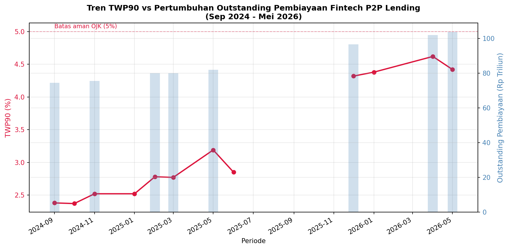
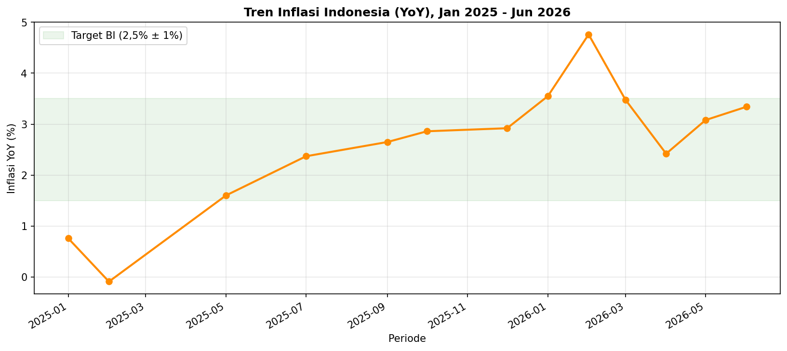
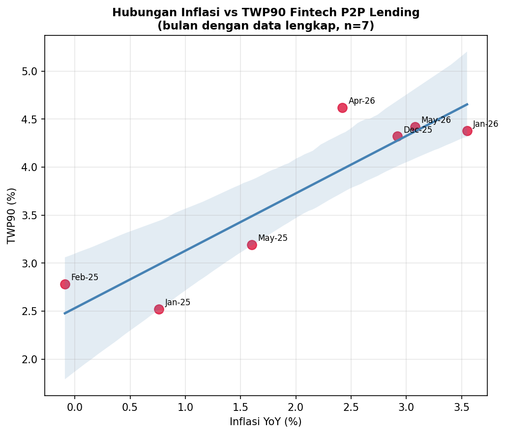
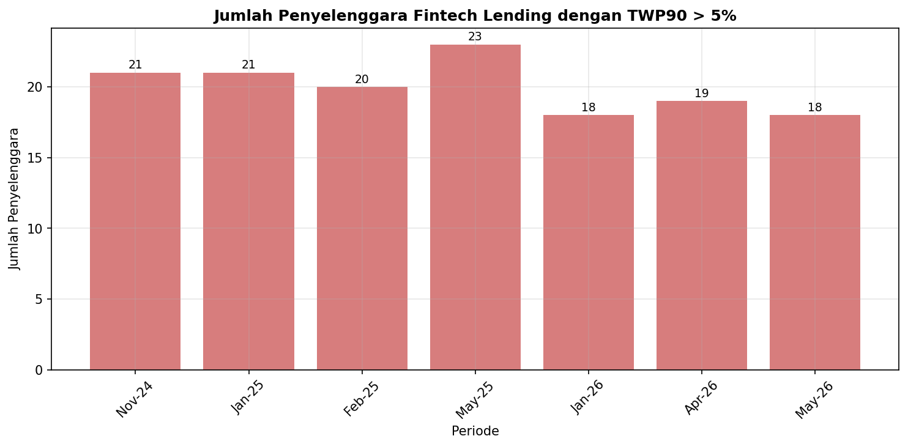

# 💳 Analisis Risiko Gagal Bayar Kredit Fintech P2P Lending di Tengah Inflasi Rupiah

<p align="center">
  
</p>

<p align="center">
  
  
  
  
</p>

> **TL;DR** — Outstanding pembiayaan fintech P2P lending Indonesia tumbuh >25% YoY, tapi TWP90 (kredit macet 90 hari) ikut naik mendekati batas aman OJK 5%. Analisis ini menguji apakah inflasi rupiah — yang sempat melonjak ke 4,76% pada Feb 2026 — punya andil dalam tren tersebut, dan menemukan korelasi positif kuat (r = 0,900) sekaligus pola konsentrasi risiko yang lebih mengkhawatirkan dari yang terlihat di angka rata-rata industri.

---

## 📌 Daftar Isi

- [Latar Belakang](#-latar-belakang)
- [Pertanyaan Riset](#-pertanyaan-riset)
- [Sumber Data](#-sumber-data)
- [Metodologi](#-metodologi)
- [Temuan Utama](#-temuan-utama)
- [Rekomendasi](#-rekomendasi-manajemen-risiko)
- [Struktur Repo](#-struktur-repo)
- [Cara Menjalankan](#-cara-menjalankan)
- [Tech Stack](#-tech-stack)
- [Limitasi & Pengembangan Lanjutan](#-limitasi--pengembangan-lanjutan)
- [Kontak](#-kontak)

---

## 🎯 Latar Belakang

Fintech *peer-to-peer* (P2P) lending — akrab disebut *pindar* (pinjaman daring) — jadi tulang punggung pembiayaan bagi UMKM dan masyarakat *underbanked* di Indonesia. Tapi pertumbuhan yang agresif punya sisi gelap: semakin cepat penyaluran kredit, semakin besar tekanan pada kualitas portofolio — apalagi di tengah gejolak inflasi yang menggerus daya beli.

Proyek ini lahir dari rasa ingin tahu sederhana: **kalau harga-harga naik, apakah orang jadi lebih sering telat/gagal bayar cicilan pinjol?** Dan datanya berbicara — meski dengan beberapa catatan penting yang jujur saya sampaikan di bagian limitasi.

## ❓ Pertanyaan Riset

| # | Pertanyaan |
|---|---|
| 1 | Bagaimana tren TWP90 berkembang seiring pertumbuhan outstanding pembiayaan? |
| 2 | Apakah ada korelasi statistik antara inflasi rupiah dan tingkat gagal bayar (TWP90)? |
| 3 | Apakah risiko gagal bayar merata, atau terkonsentrasi pada penyelenggara tertentu? |
| 4 | Apa implikasinya bagi strategi manajemen risiko kredit ke depan? |

## 📊 Sumber Data

Semua data **riil**, dikutip langsung dari sumber resmi — bukan data simulasi:

| Dataset | Sumber | Periode |
|---|---|---|
| TWP90, outstanding pembiayaan, jumlah platform berisiko tinggi | [OJK](https://ojk.go.id) — Siaran Pers RDKB & pemberitaan resmi (Kontan, Bisnis.com, Antara, Bloomberg Technoz) | Sep 2024 – Mei 2026 |
| Inflasi IHK (YoY & MtM) | [BPS](https://bps.go.id) — Berita Resmi Statistik | Jan 2025 – Jun 2026 |

📁 Lihat [`data/`](data/) untuk file mentahnya lengkap dengan kolom sumber per baris.

## 🔬 Metodologi

```
Load & Clean  →  Merge by Period  →  EDA & Visualisasi  →  Uji Korelasi (Pearson & Spearman)
     →  Lag Analysis (0–3 bulan)  →  Segmentasi Risiko Bulanan  →  Insight & Rekomendasi
```

Seluruh proses ada di [`proyek_risiko_kredit_p2p_lending.ipynb`](proyek_risiko_kredit_p2p_lending.ipynb) — reproducible, terdokumentasi, dan bisa dijalankan ulang dari nol.

## 🔑 Temuan Utama

### 1️⃣ Pertumbuhan vs Kualitas Kredit: Trade-off Klasik
Outstanding pembiayaan naik dari ±Rp75,6T (Nov 2024) → Rp103,7T (Mei 2026), tapi TWP90 ikut naik dari ~2,5% ke ~4,4% — mendekati batas aman OJK 5%.

### 2️⃣ Inflasi Melonjak ke Titik Tertinggi
<p align="center"></p>

Inflasi YoY melonjak ke **4,76% pada Februari 2026** — tertinggi dalam periode observasi — didorong sektor perumahan, transportasi, dan personal care.

### 3️⃣ Korelasi Inflasi ↔ TWP90: Positif & Kuat (dengan Catatan)
<p align="center"></p>

| Metode | Koefisien | p-value |
|---|---|---|
| Pearson | **r = 0,900** | 0,006 |
| Spearman | ρ = 0,714 | 0,071 |

> ⚠️ **Jujur soal keterbatasan:** hasil ini dihitung dari **n = 7 bulan** saja karena OJK tidak konsisten merilis angka presisi tiap bulan di sumber publik. Korelasi kuat, tapi sampel kecil — jadi ini sinyal yang layak ditindaklanjuti, bukan bukti kausal final. Detail lengkap ada di bagian [Limitasi](#-limitasi--pengembangan-lanjutan).

### 4️⃣ Risiko yang "Bersembunyi" di Balik Rata-rata Industri
<p align="center"></p>

Ini temuan yang menurut saya **paling kuat secara analitis**: meski TWP90 agregat industri masih di bawah 5%, **18–23 penyelenggara (±20% dari total platform terdaftar)** secara konsisten berada di zona TWP90 > 5% setiap bulan. Rata-rata yang "aman" menyembunyikan konsentrasi risiko nyata di segmen tertentu.

## 💡 Rekomendasi Manajemen Risiko

- **Credit scoring** — masukkan variabel makro (inflasi, harga pangan/energi) sebagai *early warning indicator*
- **Portfolio monitoring** — segmentasi risiko berbasis sektor (produktif/UMKM vs konsumtif)
- **Collection strategy** — perkuat collection 1–3 bulan pasca lonjakan inflasi (efek jeda waktu)
- **Regulasi** — dukung pembatasan rasio utang terhadap pendapatan untuk cegah *over-leverage*
- **Funding** — diversifikasi sumber pendanaan untuk jaga stabilitas likuiditas

Detail lengkap + justifikasi ada di [laporan Word](output/Laporan_Analisis_Risiko_Kredit_P2P_Lending.docx).

## 🗂 Struktur Repo

```
proyek_risiko_kredit_p2p/
├── data/
│   ├── ojk_p2p_lending.csv        # TWP90, outstanding, platform berisiko
│   └── inflasi_bps.csv            # Inflasi YoY & MtM
├── output/
│   ├── Laporan_Analisis_Risiko_Kredit_P2P_Lending.docx
│   └── 01–05_*.png                # Chart hasil analisis
├── proyek_risiko_kredit_p2p_lending.ipynb   # Notebook lengkap (kode + narasi)
└── README.md
```

## 🚀 Cara Menjalankan

```bash
# 1. Clone repo
git clone https://github.com/<username>/analisis-risiko-kredit-p2p-lending.git
cd analisis-risiko-kredit-p2p-lending

# 2. Install dependencies
pip install jupyter pandas numpy matplotlib seaborn scipy

# 3. Jalankan notebook
jupyter notebook proyek_risiko_kredit_p2p_lending.ipynb
# lalu Run All Cells
```

## 🛠 Tech Stack

`Python` · `pandas` · `numpy` · `matplotlib` · `seaborn` · `scipy.stats` · `Jupyter Notebook`

## ⚠️ Limitasi & Pengembangan Lanjutan

- Data OJK tidak dipublikasikan dalam satu dataset bulanan terbuka → beberapa bulan (Jul–Nov 2025) tidak punya angka presisi di sumber publik
- Jumlah observasi berpasangan (inflasi × TWP90 di bulan sama) kecil (n=7) → hasil korelasi bersifat indikatif
- Data agregat industri, bukan granular per-platform/debitur

**Rencana pengembangan:**
- [ ] Tarik data langsung dari file Statistik LPBBTI resmi OJK (ojk.go.id) untuk mengisi bulan yang kosong
- [ ] Tambahkan variabel BI Rate, kurs Rupiah, dan indeks kepercayaan konsumen
- [ ] Bangun model prediktif (ARIMAX / regresi time-series dengan lag)

---

<p align="center"><i>Dibuat oleh <a href="https://github.com/alnafs23">alnafs23</a> — bagian dari portofolio Data Analyst, Juli 2026</i></p>
